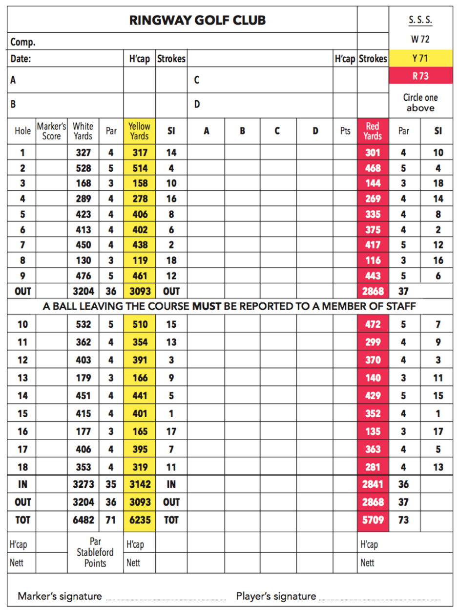

# Examen de Programación: Sistema de Puntuación de Golf

## Descripción

Desarrollar un sistema en Java para calcular las puntuaciones de un partido de golf siguiendo las modalidades "Stroke Play" y "Stableford". El sistema debe procesar los golpes realizados por varios jugadores en un recorrido de 18 hoyos y calcular sus puntuaciones según ambas modalidades.



## Clases proporcionadas

Se proporcionan dos clases base para el desarrollo:

### `App.java`
Contiene el programa principal con ejemplos de uso del sistema, incluyendo:
- Creación de jugadores y sus recorridos
- Ejemplos de puntuaciones en ambas modalidades
- Salida esperada del programa

### `Course.java`
Clase que gestiona el campo de golf y los recorridos de los jugadores, proporcionando:
- Almacenamiento de golpes por jugador y hoyo
- Métodos para añadir y recuperar recorridos de jugadores

## Requisitos

1. **Gestión de Jugadores**
   - Implementar una clase `Player` que almacene:
     - Iniciales del jugador (String)
     - Hándicap (Byte)
     - Puntuación total (Short)
     - Puntos Stableford (Short)

2. **Tarjeta de Puntuación**
   - Implementar una clase `ScoreCard` que gestione:
     - Hasta 4 jugadores (A, B, C, D)
     - Lista de hoyos con su par correspondiente
     - Referencia al campo (Course)

3. **Modalidades de Juego**
   - Implementar el patrón Strategy para las dos modalidades de puntuación:
     - **Stroke Play**: suma total de golpes
     - **Stableford**: puntos según la diferencia con el par del hoyo
       * Double Bogey (≥2 sobre par): -3 puntos
       * Bogey (1 sobre par): -1 punto
       * Par: 0 puntos
       * Birdie (1 bajo par): 2 puntos
       * Eagle (2 bajo par): 5 puntos
       * Albatross (3 bajo par): 8 puntos

4. **Requisitos de Implementación**
   - Usar el patrón Strategy para las modalidades de juego
   - Implementar el principio Open/Closed
   - Utilizar Optional para la gestión de jugadores
   - (Opcional) Usar Streams para el procesamiento de datos
   - Implementar un tipo enumerado para el sistema Stableford

## Ejemplo de Uso

Salida por consola

```bash
MJ ---> H'cap: 0        Strokes: 71     Stableford points: 0

JS ---> H'cap: 0        Strokes: 73     Stableford points: 0

Numero de hoyos: 18

Birdie: 2
Eagle: -1

MJ ---> H'cap: 0        Strokes: 71     Stableford points: 0

JS ---> H'cap: 0        Strokes: 73     Stableford points: -2

Meeseeks ---> H'cap: 0  Strokes: 71     Stableford points: 8
```

```java
Course augusta = new Course();
Byte[] coursePlayerA = {4, 5, 3, 4, 4, 4, 4, 3, 5, 5, 4, 4, 3, 4, 4, 3, 4, 4}; // 71
Player playerA = new Player("MJ", (byte) 0);
augusta.addPlayerCourse(playerA, coursePlayerA);

// ... configuración de más jugadores ...

// Calcular puntuación Stroke Play
GolfPlay strokePlay = new StrokePlay();
ComputeCard computeStrokePlay = new ComputeCard(scoreCard, strokePlay);
computeStrokePlay.compute();

// Calcular puntuación Stableford
GolfPlay stablefordPlay = new Stableford();
ComputeCard computeStableford = new ComputeCard(scoreCard, stablefordPlay);
computeStableford.compute();
```

## Evaluación

Se valorará:
1. Correcta implementación del patrón Strategy
2. Uso adecuado de Optional y Streams
3. Implementar un tipo enumerado para el sistema Stableford
4. Implementación del principio Open/Closed
5. Implementación de pruebas unitarias

## Entrega

- Código fuente en Java
- Pruebas unitarias
- Repositorio en github